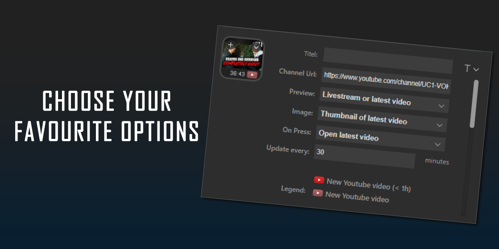
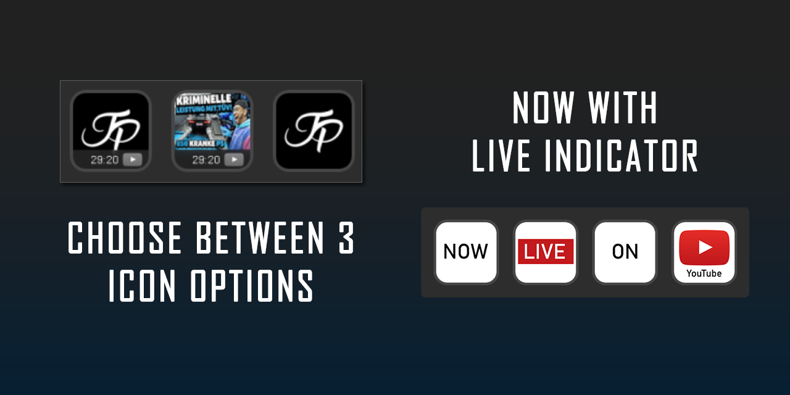

# Streamdeck-YoutubeTicker

A YouTube Ticker plugin for StreamDeck.

## Overview

Streamdeck-YoutubeTicker is a plugin designed for Elgato StreamDeck devices. It allows you to link any StreamDeck button to a YouTube channel of your choice and display various channel-related information directly on your device. The plugin is compatible with both Windows and Mac OS.

## Features

- Link any StreamDeck button to a YouTube channel of your choice
- Multiple display options per button:
  - Show only the channel logo
  - Show the thumbnail of the latest video
  - Show the thumbnail of the latest video and indicate whether it has already been watched
- Real-time updates on StreamDeck keys
- Support for multiple channels
- Customizable display options
- Works on Windows and Mac OS

## Button Actions

When pressing a button, you can choose between several actions:
- Refresh the displayed information
- Open the linked YouTube channel
- Open the latest video of the channel

## Requirements

- Elgato StreamDeck device
- .NET 8 or .NET 9 runtime (depending on your build)
- Internet connection for fetching YouTube data

## Installation

1. Download the latest release from the [Releases](https://github.com/yourusername/Streamdeck-YoutubeTicker/releases) page.
2. Install the plugin using the StreamDeck software:
   - Open StreamDeck.
   - Go to __Settings__ > __Plugins__.
   - Click __Install Plugin__ and select the downloaded file.
3. Configure your YouTube channel in the plugin settings.

## Usage

- Add the YouTube Ticker action to a StreamDeck.
- Enter your YouTube channel ID or username in the settings.
- Select your preferred display option.
- The key will show the selected channel information and allow you to perform the configured actions.

## Configuration

- You can customize the refresh interval, displayed statistics, and appearance in the plugin settings.

## Contributing

Contributions are welcome! Please open issues or submit pull requests via GitHub.

## License

This project is licensed under the MIT License.

## Disclaimer

This project is not affiliated with Elgato or CoinMarketCap. Use at your own risk.formation, visit the [GitHub repository](https://github.com/yourusername/Streamdeck-YoutubeTicker)